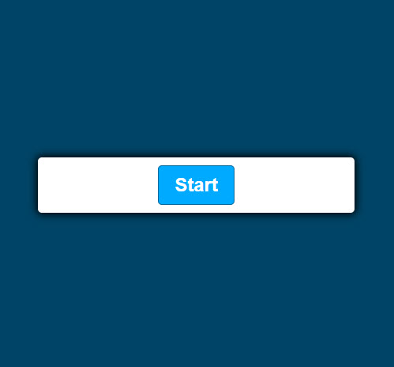
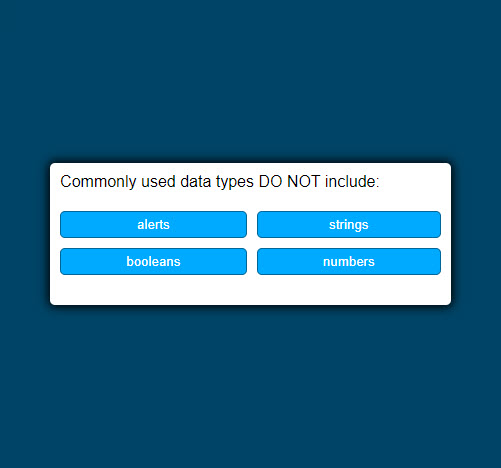
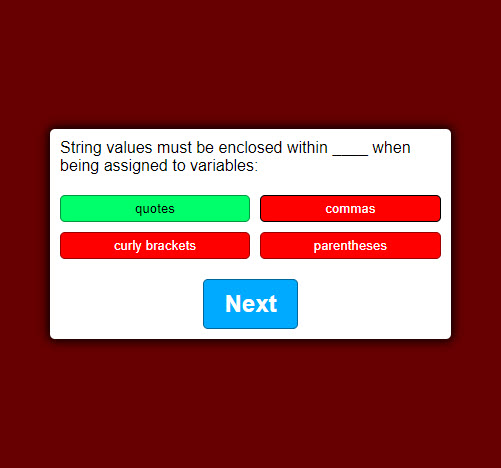

# 04 Web APIs: Code Quiz

## User Story

```
AS A coding boot camp student
I WANT to take a timed quiz on JavaScript fundamentals that stores high scores
SO THAT I can gauge my progress compared to my peers
```

## Acceptance Criteria

```
GIVEN I am taking a code quiz
WHEN I click the start button
THEN a timer starts and I am presented with a question
WHEN I answer a question
THEN I am presented with another question
WHEN I answer a question incorrectly
THEN time is subtracted from the clock
WHEN all questions are answered or the timer reaches 0
THEN the game is over
WHEN the game is over
THEN I can save my initials and my score
```

## Mock-Up

A user clicks through an interactive coding quiz, then enters initials to save the high score before resetting and starting over. My resulting homework submission is a bit more simplistic, with an interactive coding quiz, without the ability to save a high score or a timer. It is dynamic and has sections that respond dynamically to input. It is responsive to click events and and gets Element by ID. It does not have a timer or save the high score, but displays the functionality of a quiz application using javascript.

This shows the quiz start



This shows the first question. The beginning question is hidden and there are dynamic changes to the page based on answers.



The screen changes to red based on a wrong choice. You can see there is a next button.



This layout is designed for desktop viewing, but optimized for mobile. 

URL: https://ckishel.github.io/homework4_web_api_code_quiz/